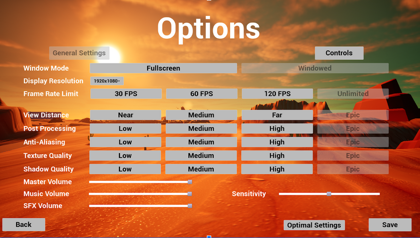
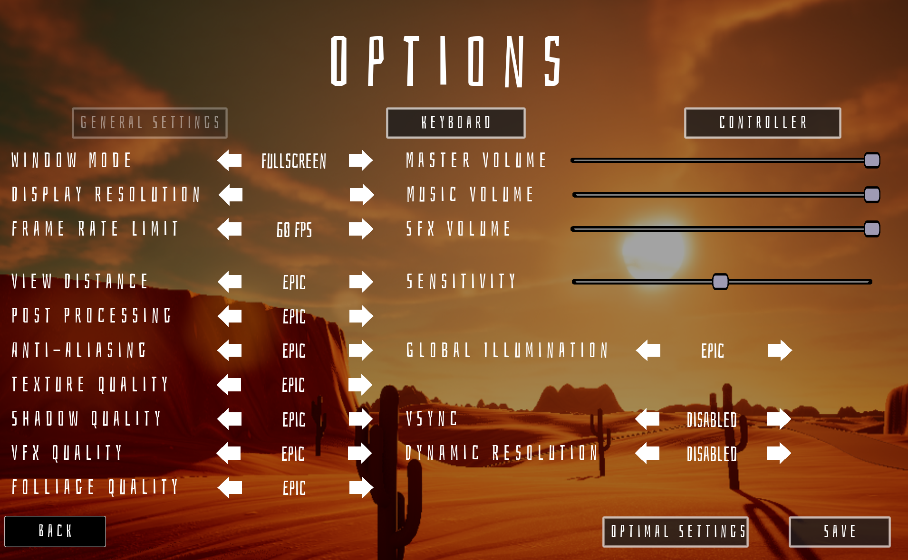

<main>
  

    
	  
      

        <iframe src="https://www.youtube.com/embed/7abHmjIE3aU" title="Dead Pedal Trailer" allowfullscreen style="position: absolute; top: 0px; left: 0px; width: 100%; height: 99%;" frameborder="0" allow="accelerometer; autoplay; clipboard-write; encrypted-media; gyroscope; picture-in-picture; web-share"></iframe>
      

    
	
    

      
						  Dead Pedal is a 3rd person, action, open world driving game set in a fictional version of the Mojave desert, where your goal is to cause as much chaos and destruction as possible. Go out and explore the world's threats to get revenge for your fallen goldfish, Ted. 

    

    
	  
      

        <iframe src="https://www.youtube.com/embed/6ET4GNiLwMs" title="Dead Pedal Garage Demo" allowfullscreen style="position: absolute; top: 0px; left: 0px; width: 100%; height: 99%;" frameborder="0" allow="accelerometer; autoplay; clipboard-write; encrypted-media; gyroscope; picture-in-picture; web-share"></iframe>
      

    
	
    <h2 class="text-center my-4 fs-1">Garage</h2>
    

    

      

						  When the garage is first loaded in it generates menu tabs and item buttons based on data tables. The menu creates new item buttons as needed when switching tabs, and make any buttons that aren't needed by a tab unseen and not intractable by the player until the player goes to a tab that needs them. Each data table (Pictured below) contains the values which correspond to each button including: item name, item ID, static mesh, material instance, locked status, etc. The data tables are designed to be easily modified by other members of the team, so the system is not dependent on me for adding new customization options. 
      

    

    

      
    

    

      

						  When a user clicks an item button, system passes the corresponding car part to a storage object. When you leave the garage the player car pulls and applies the new meshes and materials from the storage object. 
      

    

    <h2 class="text-center my-4 fs-1">Settings Menu</h2>
    

    

      

						  The settings menu was designed with the intent to provide the player with a variety of options to help improve their experience. It started out with an interest in trying to provide ways to optimize graphical performance as well as allow the player to rebind controls. The design became oriented primarily around buttons and trying to provide each sub option as a simple click. While this was easy to set up, it took up a lot of space on the screen.
      

    

    

      
    

    

      

						  I made a smaller UI widget which allowed the player to push arrow keys to change the settings values, doing this allowed for more options to be displayed and make it easier to keep track of which setting the player is interacting with. In the push for optimization I projected one of Unreals functions, a benchmark test, to the front in the form of a button. When pressed, the benchmark button checks the computer and updates all of the users settings to reflect the results of the test. 
      

    

    

      
    

    <h2 class="text-center my-4 fs-1">Tools & Technical Information</h2> 
    

    

      

        
        {{ label }}
        
      

    

 

</main>

Steam Page: <a href="https://store.steampowered.com/app/2250160/Dead_Pedal/" target="_blank">Click Here</a> 
itch.io Page: <a href="https://larnio.itch.io/dead-pedal" target="_blank">Click Here</a>

