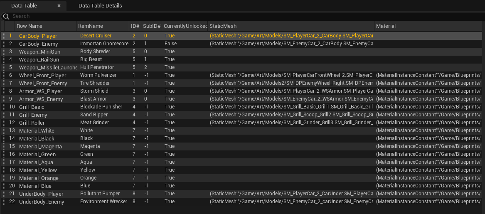

  <iframe src="https://www.youtube.com/embed/hmdd7PEL4Rg" title="Dead Pedal Trailer" allowfullscreen></iframe>

Dead Pedal is a 3rd person, action, open world driving game set in a fictional version of the Mojave desert, where your goal is to cause as much chaos and destruction as possible. Go out and explore the world's threats to get revenge for your fallen goldfish, Ted. 
  

  <iframe src="https://www.youtube.com/embed/meNLQpxT9xs" title="Garage Video" allowfullscreen></iframe>

<h2>Description:</h2>

When the garage is first loaded in it generates menu tabs and item buttons based on data tables. The menu creates new item buttons as needed when switching tabs, and make any buttons that aren't needed by a tab unseen and not intractable by the player until the player goes to a tab that needs them. Each data table (Pictured below) contains the values which correspond to each button including: item name, item ID, static mesh, material instance, locked status, etc. The data tables are designed to be easily modified by other members of the team, so the system is not dependent on me for adding new customization options. 

 

   
 

When a user clicks an item button, system passes the corresponding car part to a storage object. When you leave the garage the player car pulls and applies the new meshes and materials from the storage object. 

<h2>Technical Information:</h2> 

Developed in UE5 and Visual Studios

<h2>Postmortem:</h2> 

While this is still currently in development, I'm very happy with how this turned out. The structure of the system was well thought out but is lacking in it's flexibility. Each item type has specific change cases and with that I have not succeed in making a universal change case. Currently with the decal system added my goals for the system change to improving readability as well as adding a color wheel for player's to chose their own car color along with preset options that. are more specialized. As I continue development on the system, I want to make it as flexible as possible and allow for more types of customization beyond just meshes and materials.

Steam Page: <a href="https://store.steampowered.com/app/2250160/Dead_Pedal/">Click Here</a>

itch.io Page: <a href="https://larnio.itch.io/dead-pedal">Click Here</a>
