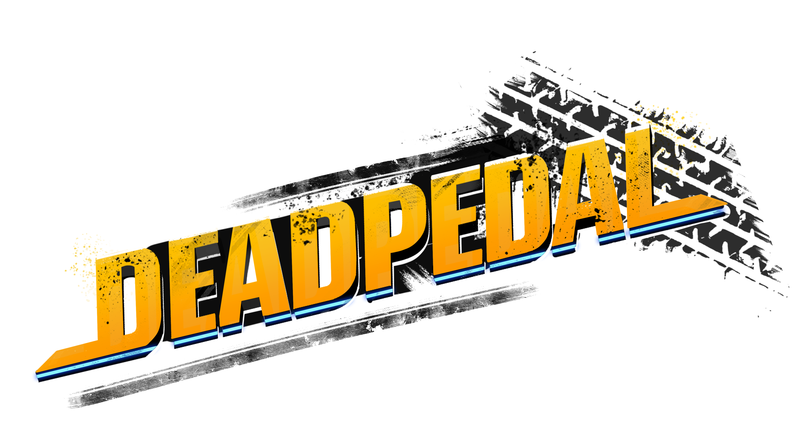

<main>
  

    

      <iframe src="https://www.youtube.com/embed/f6xTHd7CBD0?si=ooNljA1lKjgeIscB" title="Deadpedal Progress" allowfullscreen style="position: absolute; top: 0px; left: 0px; width: 60%; height: 50%;" frameborder="0" allow="accelerometer; autoplay; clipboard-write; encrypted-media; gyroscope; picture-in-picture; web-share"></iframe>
    

    

      

						  Deadpedal is a fast pace 3D arcade-style combat racing game. You race against AI in single player or against your friends and strangers in online multiplayer. Pickup powerups and sabotage your opponents, while you race on various tracks. Players can choose between twelve racers, hailing from around the world, who are invited to compete in an underground racing series with one goal in mind, to win.  
						  While Deadpedal has been in development for many years, my tenure on the game started in September of 2023 and has continued to present day. We are currently a team of 15 developers and have varied in size over the time of the game's development. We plan to release on steam in late 2025.

    

    <h2 class="text-center my-4 fs-1">Cars</h2>
    

    

      
    

    

      

						  For my programming test when I was first recruited to the studio, I was handed a vehicle system and an AI system and told to make them function together. Since then, everything the team and I have done with the cars has been build around the marriage of the two systems. I have worked on adding support for the various powerups, overhauling the camera, adjusting the car's gravity, max speed, accerlation, suspension, and more.  
							  Deadpedal is a complicated game and continues to go through various iterations on howwe want it to feel when the players are racing around the various tracks. After a demo build went out internally, I was tasked with overhauling the exisiting player camera set up to better convey speed and to implement camera drag based on the strength of the car's acceleration, this being seem primarily with the Speed Boost powerup and Boost Pads.
      

    

    <h2 class="text-center my-4 fs-1">Powerups & Environmental Hazards</h2>
    

    

      
    

    

      

						  After the departure of a fellow programmer from the team, I inhertied responsibility forthe powerups. At the time there was only a template, a manager component for the player, two powerups in a prototyped state. Since I took over, I expanded the total to 7 powerups and have continued to update the manager to expand it's ability to interact with other system such as the HUD and the player camera, for when the player uses a Speed Boost to increase their acceleration to effect camera drag. The current powerups include: Speed Boost, Homing Missile, Shockwave, Shield, Smokescreen, and more.  
							  One of the unique elements of Deadpedal is that each track comes with an Environmental Hazard, such as the volcanic eruption on the tropical island track or the explosion of an old gas station on our western usa desert track. In the game, these take the form of powerups that player can pickup, unlike regular powerups they alter the track and serve as a potential hazard to every player. These have been a fun challenge as they need to work within the powerup structure but effect systems outside of the manager I've had to work closely with artists for both Powerups and Environmental Hazards, mainly the VFX team, to ensure smooth implementation of their assets and that it we have a unified vision of how these systems function.
      

    

    <h2 class="text-center my-4 fs-1">UI</h2>
    

    

      
    

    

      

						  One of my reocurring roles has been working with UI team to add / iterate on the functionality for the UI as well as to help plan potential systems to support the UI, such as how to distinquish between input from Playstation and Xbox controllers. We ended up putting this on hold in favor of a general check for Mouse and Keyboard vs Gamepad, having the option toggle controller specific UI being in the settings. While working on the UI, I've developed data structures to help manage the data being passed to the UI with the first one being for the leaderboard. The leaderboard structure has allowed me to focus what data is past over to the UI code while being easily expandible whenever the team deicides to change what information to display.
      

    

    <h2 class="text-center my-4 fs-1">Tools & Technical Information</h2> 
    

    

      

        
        {{ label }}
        
      

    

 

</main>
