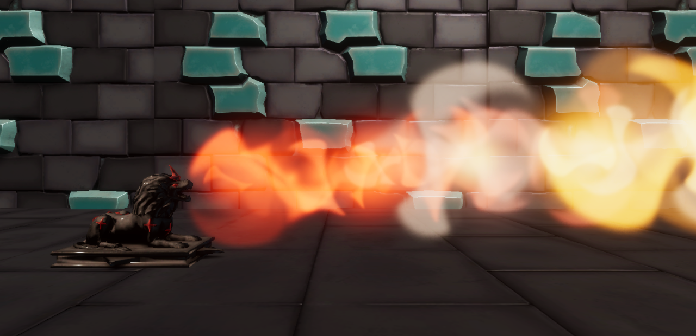

In Mini Infinity, players take the role of Mini, a star-mage in training, tasked with defending themselves against many hordes of crystalline enemies. Players must enchant enemies and other objects around the arena to throw. Occasionally, powerful relics will appear that will allow Mini to change the tide of battle. Different events may also occur, such as lava pits, that will constantly keep the player on their toes.

This game was created during a production class in my spring semester, during my third year, at Champlain College. In this 3D wave based shooter, the player controls Mini, a young star mage hoping to pass the trials their professor has set for them by defeating the waves of Crystalline enemies. As the main programmer for our game my implemented many of our games systems and mechanics including, Player and Enemy characters, Item, UI, and Animation implementation.

 <h3 class="display-4">Character:</h3>
 
The player needed to be able to move around the map and effectively combat the
approaching enemies meanwhile the enemies needed to be able to move towards and
attack the player. To handle all of this I created a player movement and actions
system and multiple enemy AI's to allow for the necessary interaction between the 
two groups.

For the enemy AI I utilized Unity's Nav Mesh to determine the moveable terrain.
And each enemy type had its own behavior system which helped to determine how
it should act depending on what is happening in the world around it. Pictured
bellow is a piece of Ranged Enemy AI:

 <h3 class="display-4">Item:</h3>
 
One of the system we included in our game was referred to as the Relic system. 
Relics are items that can spawn throughout the game and help the player if they 
are being overwhelmed by the number of enemies around them. In the game we only 
have one type of Relic, the Leo or Fire Relic (Pictured bellow). The Leo Relic 
when put on the ground would blast out a cone of fire destroying any enemies 
which came in its path.

In order to get the Relic fit for the game, I needed to set a framework to allow 
for the Relic to have 2 different materials (depending on if it's active or not),
the flame VFX and the behind the scenes code that made it all come together and 
work seamlessly. This was handled in a way which allowed for an easy conversion
to an item base class if we able to add more Relics. Pictured bellow is the Relic:

 <h3 class="display-4">UI:</h3>

I created a full settings menu to give the player the ability to customize the
experience they are having while playing the game, with options to adjust volume,
rebind their controls, and change camera sensitivity. In while in play there are
multiple panels which convey to the player information about their run: Health,
score, wave number and number of active enemies.

For the control binding, I decided to create my own system to manage and store
the player preferences and update any scripts which rely on player input. Like
with the rest of the settings menu values, when the game is closed the player
settings are saved and reloaded when the player next interacts with the settings 
menu.

 <h3 class="display-4">Animation Implementation:</h3>

For this project we had a variety of animation to go with both our main character
and our enemies. For each animated model, I needed to create an animation controller
and appropriately link them up to the actions the player and enemies were taking to
provide accurate visual feedback

Both the player and enemies had animation controllers, each controller established
how the animations could and would transition between each other. In different movement
and attack script for the characters, variables were set which changed what animations
were active depending on what the player was doing. Pictured bellow is the player 
animation controller:

<pre>
</pre>

itch.io Page: <a href="https://home-fries-and-associates.itch.io/mini-infinity">Mini Infinity itch.io page</a>
